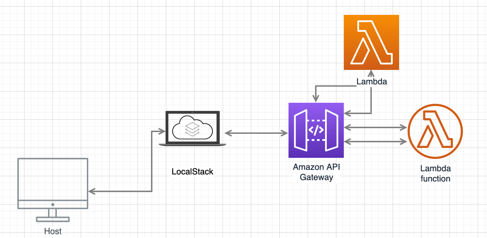

# GOServerless

Sandbox for learning AWS Cloud infrastructure technology with Golang. Integrates with LocalStack or AWS Account.

In the Diagram below, If not using LocalStack, API Gateway will be the direct line of communication with host.

What I am expecting to learn in this project.

1. Managing projects with Bazel
2. Learning AWS Services
3. Learning Golang
4. CloudFormation
5. CloudWatch

